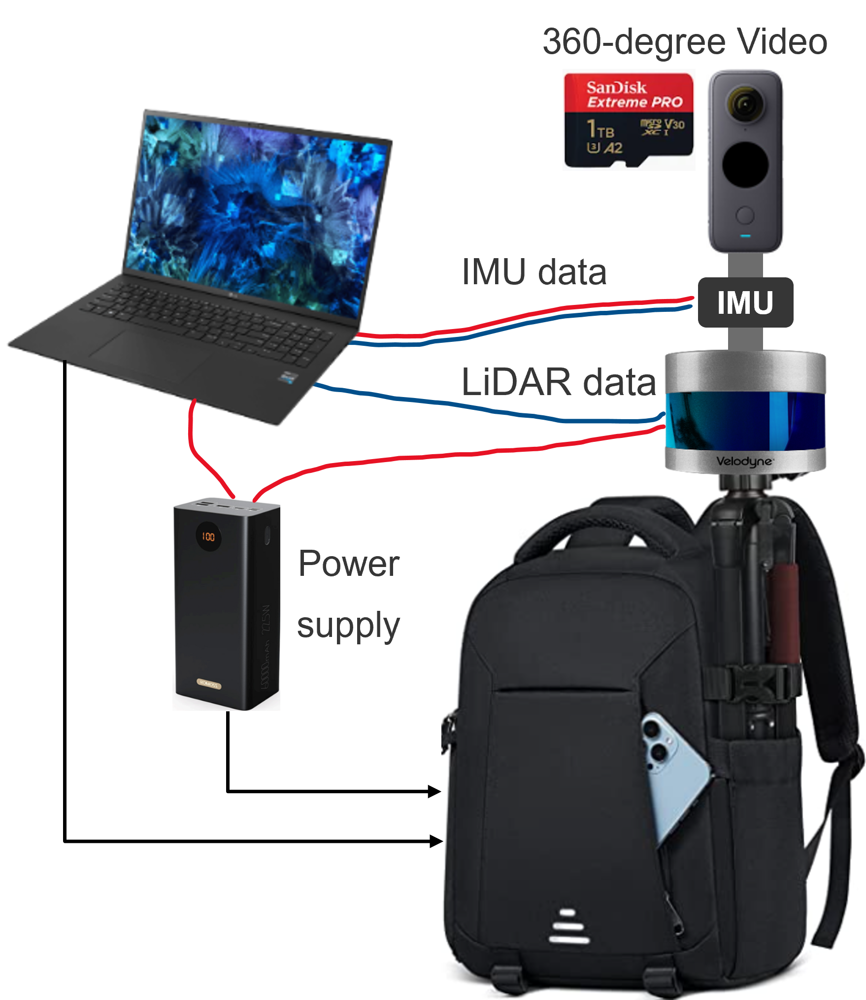
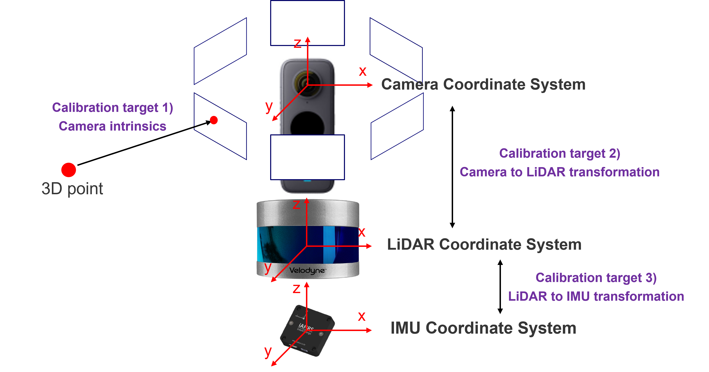
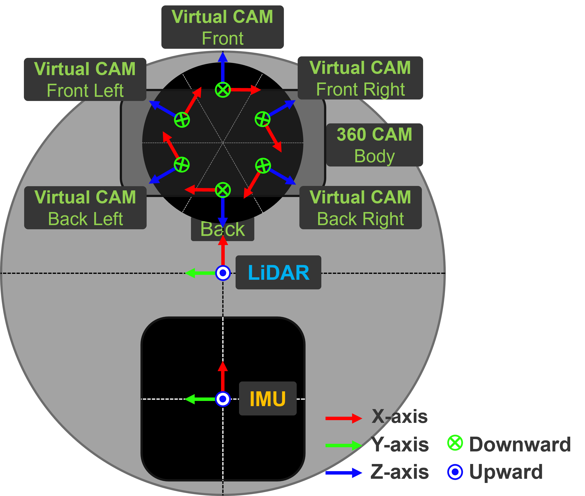

### 1. Sensor Configuration

### 2. Sensor Calibration
#### (1) Virtual camera

To mitigate the inherent distortion of 360-degree images, we split the 360-degree image into six regions using perspective projection, treating each as a separate virtual camera.

#### (2) Intrinsic/Extrinsic calibration

We first calibrated the sensor extrinsincs (sensor coordinate transformation matrices). Then, we calibrated each projected camera image’s intrinsics with the checkerboard method. An overview of the sensor coordinate systems is shown below: 

#### (3) LiDAR-IMU Odometry

We created accurate sensor movement trajectories (ego pose data) using LiDAR-IMU odometry using [Point-LIO]([https://github.com/hku-mars/Point-LIO]). 

#### (4) 3D Bounding Box Annotation (in progress)

We've generated 3D bounding box annotations for objects in the scene using the [xtreme1](https://github.com/xtreme1-io/xtreme1). Since manual annotation is time-consuming, we are working on a automatic annotation to speed up the process.