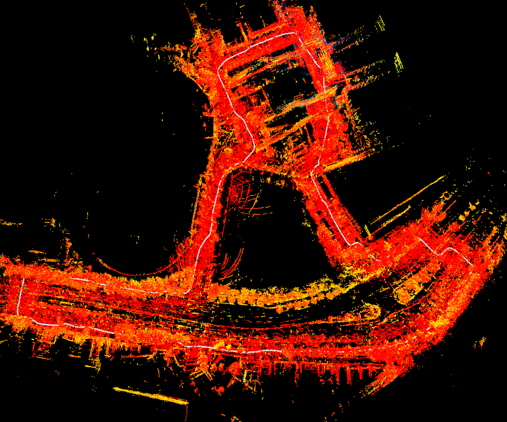

# Panoptic3D Dataset

### A multi-view, multi-modal dataset for mobile 3D perception compatible with nuScenes

Multi-view 3D perception is a fundamental task for autonomous systems. However, existing datasets like nuScenes are limited to driving scenes. Its a personal research project to create a multi-view, multi-modal dataset for mobile 3D perception, which includes various urban environments in Seoul, Korea and LA, USA, where humans or robots can move around, such as campuses, city steets, crosswalks, etc. 

<!-- 

  

 -->
 [Detailed dataset creation process](Dataset_creation.md)

### Features:
- Data types
  - Multi-view perspective images, 360-degree images, LiDAR point clouds, IMU data, camera parameters
- Annotation types
  - Camera poses, 3D bounding boxes (work in progress)
- nuScenes compatibility
  - Exacly same structure as nuScenes dataset (relational database)
  - Compatible with nuScenes devkit APIs

### Scenes:
| Location | Trajectory | Sample 360-degree image |
| --- | --- | --- |
| USC Campus, LA |  |  |
| USC Campus town, LA |  |  |
| Changcheon-dong, Seoul |  |  |
| Sinchon-dong (daytime), Seoul |  |  |
| Sinchon-dong (night), Seoul |  |  |
